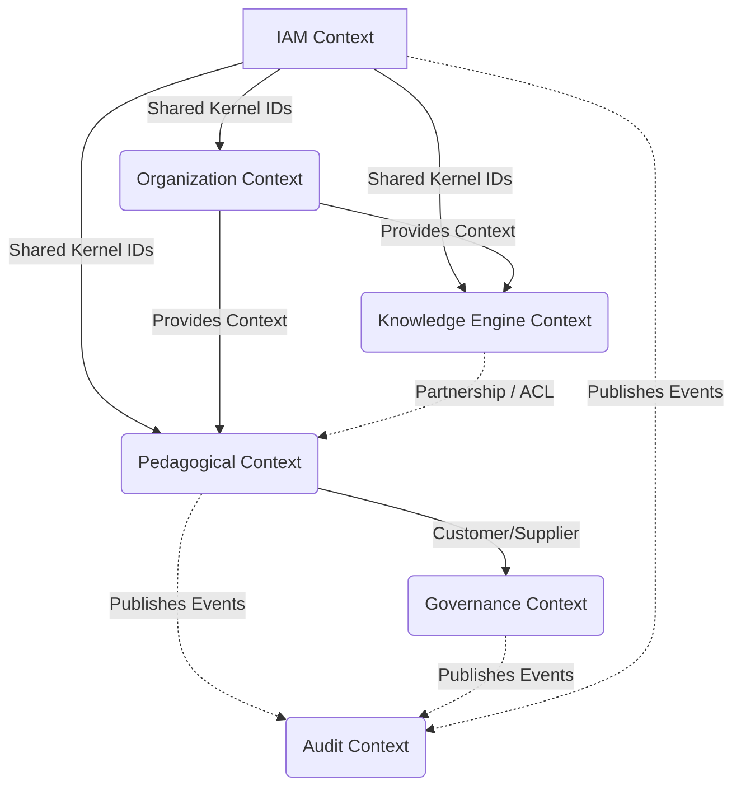

# TutorIA Platform - Strategic Domain Design
**Version:** 1.0.0
**Status:** DRAFT (Pending Architecture Review Board)

## 1. Domain Vision
TutorIA es un **Knowledge Operating System** multitenant y dirigido por eventos. Su propósito principal es elevar la calidad pedagógica proporcionando asistencia inteligente (IA) a educadores, garantizando una rigurosa gobernanza humana (Human-in-the-Loop) y un aislamiento absoluto de datos entre inquilinos (Tenants).

---

## 2. Subdomain Map

| Subdomain | Tipo | Justificación |
| :--- | :--- | :--- |
| **Pedagogical Knowledge & AI Engine** | `CORE` | El diferenciador competitivo principal. Aquí reside la "inteligencia" de TutorIA, curando conocimiento y emitiendo recomendaciones pedagógicas dinámicas. |
| **Educational Planning & Execution** | `CORE` | El ciclo de valor donde los educadores materializan las recomendaciones en planeaciones, observaciones y evaluaciones tangibles. |
| **Educational Organization** | `SUPPORTING` | Centros, grupos, aulas y niños. Es el esqueleto del sistema; indispensable para operar, pero no es la ventaja competitiva (sistemas de gestión escolar estándar). |
| **Governance & Approvals** | `SUPPORTING` | El motor de workflows que asegura que nada se aplique sin revisión. Clave para la confianza institucional. |
| **Identity & Tenant Management** | `GENERIC` | Autenticación, autorización y aislamiento. Problema estándar de la industria. |
| **Audit & Reporting** | `GENERIC` | Trazabilidad inmutable y extracción de datos. |

---

## 3. Bounded Context Map

Tras evaluar la propuesta inicial, se decide **fusionar** algunos contextos para reducir la sobrecarga de integración prematura (Microservices Premium):

1. **Identity & Access Management (IAM) Context:** Fusión de `Tenant Management` e `Identity & Access`. Un Usuario no tiene sentido sin un Tenant.
2. **Educational Organization Context:** Fusión de `Institution Management` y `Educational Operation`. La jerarquía (Institution > Center > Room > Group > Child) es un modelo estructural fuertemente cohesivo.
3. **Pedagogical Execution Context:** Se mantiene `Planning` (incluye Observaciones y Evaluaciones).
4. **Knowledge Engine Context:** Fusión de `Knowledge Management` y `AI Recommendation`. La IA y el conocimiento estructurado que consume son parte del mismo flujo de valor.
5. **Governance Context:** Evolución de `Approval Workflow`.
6. **Audit & Compliance Context:** Se mantiene puro.
7. **Analytics Context:** Evolución de `Reporting`.

### Context Dependencies

*Justificación anti-bidireccionalidad:* Los contextos fluyen hacia abajo. IAM es fundacional. Organization provee la estructura física. Pedagogical y Knowledge interactúan. Audit es un sumidero pasivo de eventos (Subscriber).

---

## 4. Aggregate Catalog

| Aggregate | Contexto | Responsabilidad | Identidad | Estado |
| :--- | :--- | :--- | :--- | :--- |
| **Tenant** | IAM | Aislamiento y ciclo de vida institucional | `TenantId` | `IMPLEMENTADO` |
| **User** | IAM | Actor humano y roles | `UserId` | `PENDIENTE` |
| **Institution** | Organization | Configuración global de una cadena | `InstitutionId` | `PENDIENTE` |
| **Center** | Organization | Sede física (ej. una Guardería) | `CenterId` | `PENDIENTE` |
| **Group** | Organization | Agrupación pedagógica (ej. Lactantes A) | `GroupId` | `PENDIENTE` |
| **Child** | Organization | Sujeto de la educación | `ChildId` | `PENDIENTE` |
| **Room** | Organization | Espacio físico / Aforo | `RoomId` | `PENDIENTE` |
| **Planning** | Pedagogical | Plan de actividades y metas | `PlanningId` | `PENDIENTE` |
| **Observation** | Pedagogical | Registro anecdótico / clínico | `ObservationId` | `PENDIENTE` |
| **Evaluation** | Pedagogical | Calificación de hitos de desarrollo | `EvaluationId` | `PENDIENTE` |
| **KnowledgeSource**| Knowledge | Corpus (Documento oficial, libro) | `KnowledgeSourceId`| `PENDIENTE` |
| **Recommendation** | Knowledge | Sugerencia generada por IA | `RecommendationId` | `PENDIENTE` |
| **Approval** | Governance | Firma / Decisión jerárquica | `ApprovalId` | `PENDIENTE` |
| **AuditLog** | Audit | Registro inmutable de transacciones | `AuditId` | `PENDIENTE` |

---

## 5. Value Object Catalog

**Shared Kernel (Globales):**
- Todos los `Ids` (`TenantId`, `CenterId`, etc.)
- `DateRange` (Inicio y fin lógicos)
- `AuditTrail` (Rastro de quién hizo qué)

**Context-Specific:**
- **IAM:** `EmailAddress`, `PasswordHash`, `Role`.
- **Organization:** `Address`, `Capacity`, `AgeRange`.
- **Pedagogical:** `PedagogicalGoal`, `ActivityDetails`, `DevelopmentArea`.
- **Knowledge:** `AIPromptProfile`, `ConfidenceScore`, `TokenUsage`.
- **Governance:** `ApprovalStatus`, `RejectionReason`, `Signature`.

---

## 6. Domain Services

Propuestos únicamente donde la lógica cruza Aggregates:
1. **`AIRecommendationEngine`**: Requiere el perfil del `Child`/`Group` (Organization), el historial de `Planning` (Pedagogical) y las fuentes habilitadas en `KnowledgeSource`. No puede pertenecer a un solo Aggregate.
2. **`ApprovalOrchestrator`**: Inicia procesos de firma en el `Governance Context` a partir de cambios de estado en un `Planning`. Garantiza que un plan no se active hasta ser aprobado.
3. **`GroupCapacityValidator`**: Valida que inscribir un `Child` en un `Group` no viole el aforo del `Room` asignado al Centro.

---

## 7. Domain Policies

- **`TenantIsolationPolicy`**: Ninguna consulta, mutación o evento puede emitirse sin un `TenantId`. Cruzar datos de Tenants es una violación crítica (bloqueo por arquitectura).
- **`HumanInTheLoopPolicy`**: Ninguna `Recommendation` de IA puede inyectarse directamente en un `Planning` en estado `ACTIVE` sin pasar por un `Approval` humano.
- **`KnowledgeEligibilityPolicy`**: El motor de IA solo puede generar inferencias a partir de `KnowledgeSources` que estén en estado `APPROVED` y vigentes.
- **`ImmutableAuditPolicy`**: Toda acción mutacional generada por un usuario lanza un evento que el `AuditContext` almacena como solo-escritura, sin API de borrado.

---

## 8. Event Storming Inicial

**IAM Context**
- `TenantCreated`, `TenantSuspended`
- `UserRegistered`, `UserRoleChanged`, `UserDeactivated`

**Organization Context**
- `CenterOpened`, `CenterClosed`
- `GroupFormed`, `TeacherAssignedToGroup`
- `ChildEnrolled`, `ChildGraduated`

**Pedagogical Context**
- `PlanningDrafted`, `PlanningSubmittedForReview`, `PlanningActivated`
- `ObservationLogged`, `EvaluationCompleted`

**Knowledge Engine Context**
- `KnowledgeSourceIngested`, `KnowledgeSourceDeprecated`
- `RecommendationGenerated`, `RecommendationAccepted`, `RecommendationRejected`

**Governance Context**
- `ApprovalRequested`, `ApprovalGranted`, `ApprovalDenied`

---

## 9. Ownership Matrix

| Aggregate | Posee Exclusivamente | Referencia por ID | Jamás debe conocer |
| :--- | :--- | :--- | :--- |
| **Planning** | Actividades, Metas, Fechas | `GroupId`, `CenterId`, `UserId` | Configuración del Tenant, Nombres de los niños |
| **Child** | Perfil médico, Edad, Nombre | `GroupId`, `CenterId` | Detalles de la IA, Planeaciones |
| **Recommendation** | Score, Sugerencia, Contexto IA | `PlanningId`, `KnowledgeId` | Nombres de usuarios |
| **Approval** | Firmas, Estados, Comentarios | *Cualquier Target ID* (`PlanningId`) | Contenido interno de lo que aprueba |

---

## 10. Dependency Matrix (Módulos / Carpetas)

| Módulo | Depende De | Jamás Depende De |
| :--- | :--- | :--- |
| `domain/iam` | `shared/kernel` | `organization`, `pedagogical`, `knowledge`, `governance` |
| `domain/organization`| `iam` (solo Ids), `shared/kernel`| `pedagogical`, `knowledge`, `governance` |
| `domain/pedagogical` | `organization` (Ids), `iam` (Ids) | `knowledge`, `governance` |
| `domain/knowledge` | `pedagogical` (Ids), `organization` (Ids) | `governance` |
| `domain/governance` | `shared/kernel` | Implementaciones concretas de otros módulos (recibe interfaces o Ids) |

---

## 11. Roadmap de Implementación

Para maximizar el valor y desentrañar dependencias, el orden de construcción será:

1. **IAM (User):** Necesario para dar contexto de actor a cualquier otra operación.
2. **Organization (Center, Group, Child):** Es el esqueleto. Nada existe sin un centro y niños.
3. **Pedagogical (Planning):** El Core primario tradicional.
4. **Knowledge (KnowledgeSource, Recommendation):** El Core diferenciador (IA).
5. **Governance (Approval):** Flujos de validación finales.
6. **Audit & Analytics:** Observabilidad (se construye en paralelo como consumers de eventos).

---

## 12. Riesgos Arquitectónicos

1. **Sincronización Eventual:** Al basarnos en `DomainEvents` y un futuro Event Bus, la UI de React podría tener latencia entre lanzar un comando y ver el read-model actualizado.
2. **Abuso de IDs:** Pasar solo IDs requiere que la capa de `Application` (Casos de Uso) realice múltiples consultas a los repositorios para armar DTOs ricos para el Frontend, aumentando la latencia de lectura si no se usa CQRS.
3. **Limites de la IA:** La generación de `Recommendation` será un proceso asíncrono pesado. El diseño debe contemplar un estado temporal (`Generating`) en el dominio.

---

## 13. Decisiones Pendientes (ADRs Futuros)

- **ADR-0010: Event Bus En Memoria vs Externo:** Decidir si en Fase 1 los `DomainEvents` se despachan sincrónicamente en el proceso Node.js o a través de un servicio externo (Google Cloud Pub/Sub).
- **ADR-0011: Persistencia Políglota:** Decidir si AuditLog irá a BigQuery mientras el Core se mantiene en Firestore.
- **ADR-0012: CQRS Read Models:** Decidir cómo se armarán las vistas para React. ¿Escucharemos eventos en Cloud Functions para armar colecciones de "Lectura Rápida" en Firestore?
