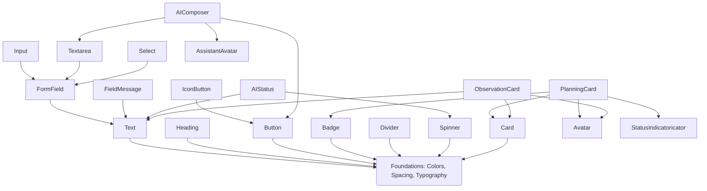

# Component Dependency Map

Este mapa establece las reglas de composición permitidas y jerarquías entre los componentes del sistema.

## 1. Principio de Aislamiento de Capas
- Los componentes `Foundations` no dependen de nada.
- Los componentes `Primitives` dependen de `Foundations`.
- Los componentes de `Forms`, `Layout`, `Navigation`, `Feedback` y `Overlays` pueden componerse a partir de `Primitives`.
- Los componentes de `Data Display` e `AI Experience` pueden consumir de todos los anteriores.
- Los componentes `Pedagogical` pueden usar cualquier elemento UI visual previo.
- **REGLA ESTRICTA:** Ningún componente primario o de layout puede importar ni depender de componentes de dominio (`Pedagogical`), previniendo ciclos y dependencias de negocio en la capa visual pura.

## 2. Mapa de Dependencias Core

## 3. Topología de Composición Explícita

### Button
- Depende de: `Typography`, `Colors`, `Radius`, `Shadows`, `Spinner` (para estado loading).

### FormField
- Depende de: `Label` (nativo HTML o Primitive Text), `Input` / `Textarea`, `FieldMessage`.

### Dialog
- Depende de: `Card`, `Overlay` (Capa oscura HTML nativa), `IconButton` (Botón cerrar).

### AIComposer
- Depende de: `Textarea` (Control de texto principal), `Button` (Submit), `AssistantAvatar` (Feedback visual).

### PlanningCard (Pedagogical)
- Depende de: `Card` (Contenedor general), `Badge` (Etiqueta de área de desarrollo), `Avatar` (Educadora asignada), `StatusIndicatoricator` (Estado de aprobación).
